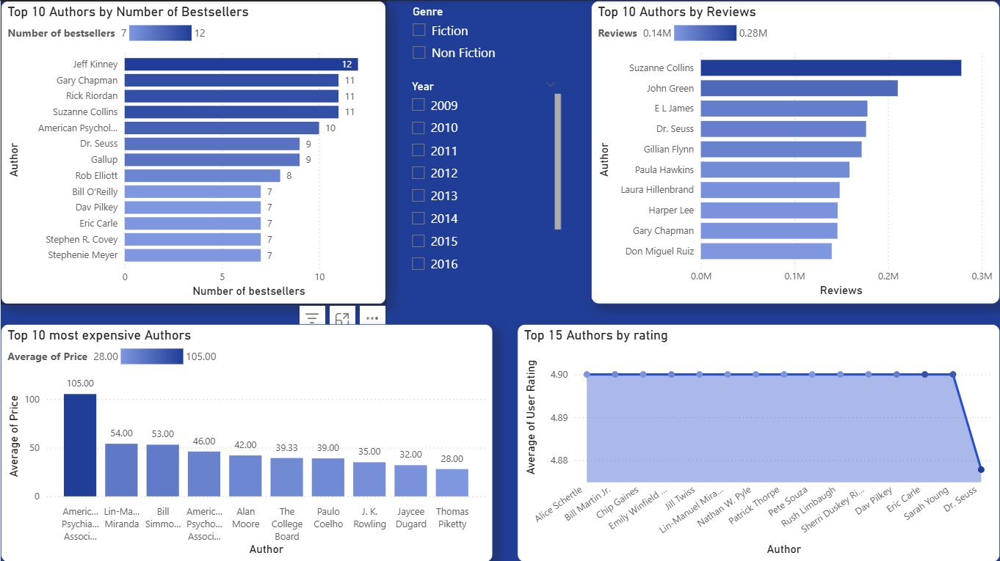

This project explores the top 50 bestselling books on Amazon from 2009 to 2019. Using this dataset, we analyze trends in pricing, genres, user engagement, and author popularity. This can help publishers, retailers, and authors better understand what sells in the book market.
________________________________________
Dataset

•	Filename: bestsellers with categories.csv

•	Source: Public dataset from Kaggle

•	Rows: 550 entries
________________________________________
Key Insights

•	We identified top authors by number of bestsellers, by reviews count, by user rating.

•	Average user rating is above 4.5 — indicating consistently positive customer feedback.

•	Most expensive books are non-fiction on the psychology science, they are very popular among customers despite of their high price.
________________________________________
Potential Use Cases

•	Market research for publishers and authors

•	Trend analysis over time (e.g., pricing or genre popularity)

•	Consumer behavior modeling (based on reviews, ratings, and price)
## 📊 Dashboard Overview

### Chart Set 

